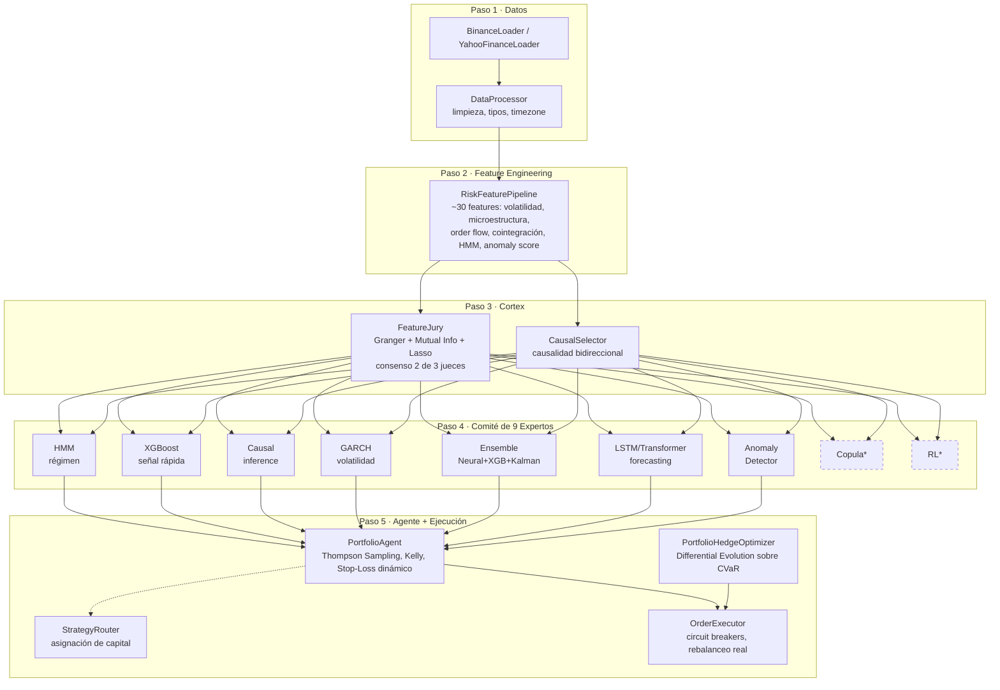

# Neural Risk Engine

Motor de trading algorítmico multi-experto para cripto, con arquitectura institucional de 5 capas: ingesta de datos → ingeniería de features → selección estadística de features → comité de 9 modelos → agente de decisión con aprendizaje adaptativo (Thompson Sampling) y hedging a nivel portafolio.

## Arquitectura


<sub>*Copula y RL son piezas de la librería pensadas para escalabilidad futura — implementadas pero no conectadas al motor activo hoy.</sub>

### Scheduling de entrenamiento (dos velocidades)

| Tier | Expertos | Frecuencia | Por qué |
|---|---|---|---|
| **Rápido** | HMM, XGBoost, Causal, GARCH, Isolation Forest | 1x/día | Modelos deterministas/basados en árboles — baratos de reentrenar |
| **Lento** | Ensemble neuronal, LSTM/Transformer, Autoencoder | cada 5 días | Redes con backprop — costosas de reentrenar |

El ciclo **live** (60-300s) nunca reentrena — solo predice con los modelos cacheados por `train_models.py`. Esto separa por completo el costo de entrenamiento del costo de inferencia.

## Resultados de backtest


*(Chart generado con `scripts/plot_backtest.py` — equity de la estrategia vs. Buy & Hold, drawdown, y distribución de PnL por trade.)*

| Métrica | Valor |
|---|---|
| Sharpe Ratio | *(completar con tu corrida real)* |
| Sortino Ratio | |
| Max Drawdown | |
| Win Rate | |
| Profit Factor | |
| VaR / CVaR (95%) | |

## Ingeniería y debugging destacado

Este proyecto pasó por una auditoría exhaustiva de principio a fin. Algunos hallazgos representativos:

- **Look-ahead bias en una feature de "delta sintético"**: usaba `series.shift(-1)` (precio del período siguiente) para calcular el valor de "hoy" — invalidaba cualquier backtest que la usara. Corregido a una diferencia hacia atrás (solo pasado/presente).
- **Circuit breaker de riesgo diario roto**: dependía de una tabla que nunca se poblaba (`update_fills()` era un `pass`) — el límite de pérdida diaria nunca se activaba, pase lo que pase. Reconectado con cierre real de stop-loss.
- **Sesgo de Kelly Criterion**: un error de orden de operaciones colapsaba el sizing a 0.05 en toda señal de reversión a la media, sin importar su magnitud real.
- **Reentrenamiento constante**: el motor reentrenaba los 9 modelos *desde cero en cada ciclo de 60s* — rediseñado con scheduling por tiers (arriba) para separar entrenamiento de inferencia.
- **Escalabilidad de imports**: el `__init__.py` del paquete importaba todo el árbol de forma ansiosa — cualquier submódulo liviano exigía instalar todas las dependencias pesadas (torch, xgboost, hmmlearn, arch). Reescrito con imports defensivos por símbolo.

## Stack técnico

`Python` · `PyTorch` · `XGBoost` · `hmmlearn` · `arch (GARCH)` · `statsmodels` · `scikit-learn` · `SQLite` · `ccxt` (Binance) · `scipy.optimize` (Differential Evolution) · `matplotlib`

## Cómo correrlo

```bash
pip install -r requirements.txt

# Backtest sobre datos históricos
python scripts/backtest.py --asset BTC --data data/BTC_USD_data.csv
python scripts/plot_backtest.py --asset BTC --data data/BTC_USD_data.csv

# Sistema en vivo (4 procesos independientes, comunicados por SQLite)
python scripts/run_data_fetcher.py    # Layer 1: ingesta
python scripts/train_models.py        # Layer 2: entrenamiento por tiers
python scripts/run_engine.py          # Layer 3-5: predicción + decisión
python scripts/run_executor.py        # Layer 6: ejecución + circuit breakers
python scripts/run_portfolio_hedge.py # Hedging a nivel portafolio (asesor)
```

## Estado del proyecto

Ver [`STATUS.md`](STATUS.md) para el detalle completo de qué está validado, qué quedó documentado como limitación conocida, y qué es alcance futuro de la librería.
